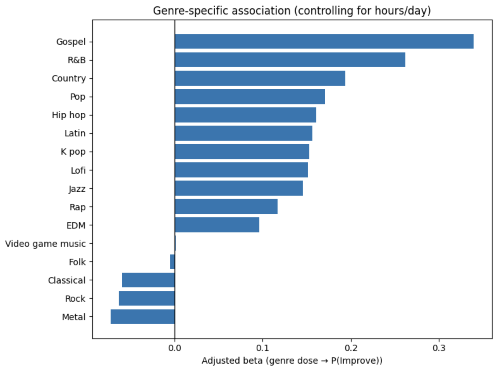

## Key Findings

- **Most respondents report music as emotionally beneficial**, but effects vary by genre and listening context.
- **After controlling for total listening time (hours/day), several genres show positive or negative associations** between genre-specific listening frequency (“dose”) and reporting emotional improvement.
- **Overall listening time is not a sufficient explanation** for perceived emotional benefit. Some less-listened genres show stronger positive adjusted associations, while heavily listened genres may be neutral or slightly negative in the adjusted model.

## Selected Figures

### Figure 1 — Adjusted genre-specific association (controlling for hours/day)
This plot shows the **adjusted coefficient** for each genre’s listening frequency (“dose”) predicting **P(Improve)** while holding hours/day constant.

---

## How to Run

1. Download the dataset from Kaggle:  
   https://www.kaggle.com/datasets/catherinerasgaitis/mxmh-survey-results

2. Place `mxmh_survey_results.csv` in your preferred directory.

3. Update the `DATA_PATH` variable in the notebook if needed.

4. Run the notebook top to bottom.
---

## Future Directions

Potential extensions of this work include:
- Longitudinal designs tracking within-person changes in listening behavior and emotional state over time.
- Demographic or contextual subgroup analyses where sample sizes permit.
- Incorporating finer-grained musical features (e.g., tempo, familiarity, lyrical content) beyond genre labels.

---

## Author Notes

This project is intended as an applied analysis demonstrating thoughtful handling of behavioral and mental health–related data, with emphasis on clarity, statistical restraint, and interpretability.
